# Assisted Curriculum Population Contract

## Decision

CurManLight must not autonomously write or replace canonical curriculum data.

The supported product direction is **assisted curriculum population**: the system may analyse trusted source documents, propose structured curriculum content and show confidence/evidence, but every item must pass through explicit human review before becoming an approved institutional proposal.

The automatic system is therefore a **proposal generator and mapping assistant**, not a canonical-data editor.

## Product objective

Reduce the manual effort required to transform institutional and normative source material into a structured curriculum while preserving:

- professional responsibility of teachers and departments;
- traceability to sources;
- separation between current curriculum, generated proposal and approved outcome;
- local-first privacy;
- reversibility;
- human validation at every institutional transition.

## User roles

### Teacher

- selects or imports source material;
- reviews suggested mappings;
- edits, accepts or rejects individual suggestions;
- exports a `teacher_proposal` package;
- cannot directly modify canonical curriculum data.

### Department

- compares proposals from multiple teachers;
- resolves duplicates and conflicts;
- consolidates one departmental outcome per curriculum target;
- records rationale and source references;
- exports a `department_outcome` package.

### Referent

- checks completeness, provenance and institutional coherence;
- confirms, rejects or suspends departmental outcomes;
- prepares the validation package for Collegio/Consiglio;
- cannot silently promote generated content to canonical status.

## Supported inputs

Initial supported input classes:

1. official normative or ministerial documents;
2. existing institutional curriculum documents;
3. department-approved local documents;
4. structured CurManLight files;
5. teacher-authored notes explicitly selected for processing.

Excluded by default:

- personal student data;
- email or cloud-drive scraping;
- unrestricted web crawling;
- automatic ingestion of unknown sources;
- content without a visible source reference.

## Processing pipeline

```mermaid
flowchart LR
    A[Source selected by user] --> B[Local parsing and segmentation]
    B --> C[Candidate curriculum statements]
    C --> D[Mapping to discipline, order, nucleus and field]
    D --> E[Evidence and confidence display]
    E --> F{Human review}
    F -->|Reject| G[Discarded suggestion]
    F -->|Edit| H[Teacher proposal]
    F -->|Accept| H
    H --> I[Department comparison]
    I --> J[Department outcome]
    J --> K[Referent validation]
    K --> L[Institutional approval outside automatic system]
    L --> M[Controlled canonical update]
```



## Mandatory states

Every generated item must expose one state:

- `generated_unreviewed`;
- `teacher_accepted`;
- `teacher_edited`;
- `teacher_rejected`;
- `department_consolidated`;
- `referent_confirmed`;
- `referent_suspended`;
- `institutionally_approved`.

No transition may skip directly from `generated_unreviewed` to `institutionally_approved`.

## Required metadata for each suggestion

Each suggestion must retain:

- stable suggestion identifier;
- source document identifier;
- source page, section or excerpt locator;
- source type and date when available;
- target discipline;
- school order;
- curriculum nucleus;
- target field;
- proposed text;
- confidence class;
- mapping rationale;
- generation timestamp;
- model or rule-set identifier when applicable;
- complete review history;
- `humanValidationRequired: true`.

## Confidence model

Confidence must be presented as a review aid, never as proof of correctness.

Recommended classes:

- **High**: explicit source text and unambiguous target mapping;
- **Medium**: source is clear but target classification requires interpretation;
- **Low**: inferred, incomplete or competing mappings exist;
- **Conflict**: multiple incompatible targets or statements were detected.

The UI must not preselect acceptance based on confidence.

## Visual companion

The review interface should use a three-column comparison model:

1. **Source evidence** — exact context and provenance;
2. **Generated mapping** — proposed discipline, order, nucleus and field;
3. **Human decision** — accept, edit, reject or defer.

Required visual cues:

- clear separation between canonical content and generated content;
- field-level diff;
- confidence badge with explanatory text;
- missing-source and conflict warnings;
- progress indicator by discipline and review state;
- no decorative AI language that obscures responsibility.

## Canonical protection rules

The system must enforce all of the following:

1. generated content is stored separately from canonical curriculum data;
2. canonical files are read-only during generation and review;
3. no bulk “accept all” operation in the first implementation;
4. every accepted item retains source provenance;
5. every canonical update requires an explicit controlled import or release step;
6. failed or partial operations leave canonical data unchanged;
7. generated proposals can be deleted without affecting canonical data;
8. all changes are reversible before institutional approval.

## Local-first architecture

Preferred implementation order:

### Phase 1 — deterministic local assistant

- local document import;
- rule-based segmentation;
- explicit mapping templates;
- no external requests;
- manual review of every item.

### Phase 2 — optional local model provider

- provider abstraction;
- processing remains on the user device where technically possible;
- no provider enabled by default;
- model output validated against a strict schema.

### Phase 3 — optional external provider

Only after a separate governance decision covering:

- data minimisation;
- explicit user consent;
- provider allowlist;
- no student or personal data;
- visible transmission warning;
- deletion and retention policy;
- offline fallback;
- institutional approval.

An external provider must never become necessary for basic curriculum consultation or manual proposal work.

## Proposed data package

A future generated package should be distinct from existing role files:

```text
fileType: assisted_curriculum_draft
role: assistant
humanValidationRequired: true
canonicalWriteAllowed: false
```

This is a design reservation only. CML-525A does not modify the `.cml` schema.

## Error and recovery contract

The system must safely handle:

- unsupported or corrupted documents;
- duplicate source imports;
- interrupted parsing;
- incomplete mappings;
- source text changes after generation;
- incompatible curriculum identifiers;
- multiple suggestions for the same target;
- browser storage failure;
- export and re-import round trips.

Recovery must preserve the original source and all completed human decisions.

## Non-goals for the first implementation

- automatic institutional approval;
- direct canonical writes;
- unattended batch generation of all disciplines;
- scraping cloud accounts;
- personalised student recommendations;
- assessment of teacher performance;
- telemetry or behavioural profiling;
- replacement of departmental deliberation.

## Minimum viable slice

The first implementation should be limited to:

- one manually selected source document;
- one discipline;
- one school order;
- a small set of curriculum fields;
- local processing only;
- suggestion-by-suggestion review;
- export as a non-canonical draft;
- complete provenance and audit trail.

Recommended pilot discipline: Tecnologia, because the existing canonical dataset, proposal library and teacher workflow provide a controlled comparison baseline.

## Acceptance gates before runtime implementation

Runtime work must not begin until the following are approved:

1. source document contract;
2. generated-draft schema;
3. stable mapping identifiers;
4. review-state machine;
5. provenance display;
6. local persistence and recovery rules;
7. accessibility and keyboard interaction specification;
8. test fixtures with known expected mappings;
9. explicit canonical promotion procedure;
10. human pilot protocol.

## Success criteria

The feature is successful only when a non-technical teacher can:

- understand what was extracted and from where;
- distinguish generated, current and approved content;
- correct a wrong mapping without losing context;
- reject an item without side effects;
- resume interrupted review;
- export a proposal whose provenance remains inspectable;
- explain that no canonical curriculum was changed automatically.

General satisfaction alone is not sufficient evidence.
