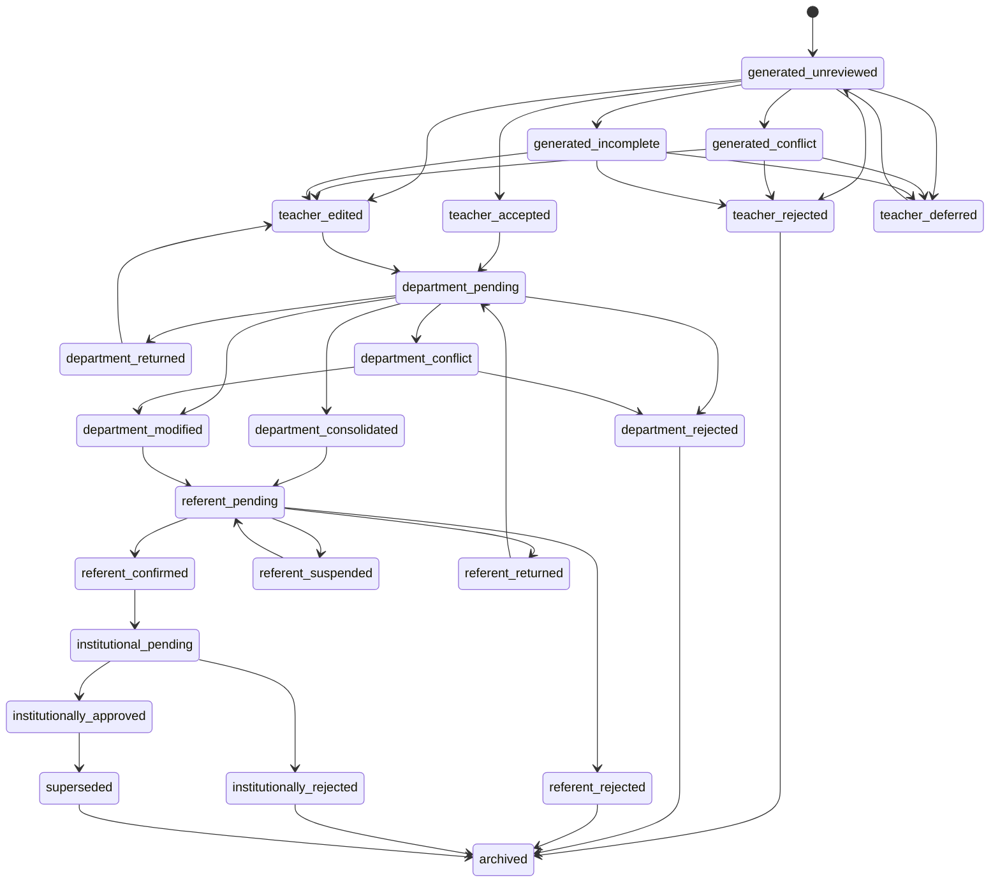

# Assisted Draft Schema and Review State Machine

## Decision

The assisted curriculum feature must produce a **non-canonical review package**. It must never write directly to canonical curriculum data and must never infer institutional approval from model confidence, source authority or user inactivity.

The reserved package type is:

```text
fileType: assisted_curriculum_draft
role: assistant
humanValidationRequired: true
canonicalWriteAllowed: false
```

This document defines the logical schema and the review-state machine. It does not change the current `.cml` schema or runtime.

## Product boundary

An assisted draft contains structured suggestions derived from explicitly selected sources. It is evidence for human deliberation, not an approved curriculum.

The package may be transformed only through explicit role transitions:

```text
assistant draft
→ teacher proposal
→ department outcome
→ referent validation
→ institutional approval outside the automatic system
→ controlled canonical release
```

No transition may skip a role boundary.

## Package-level schema

A future assisted draft should contain at least:

```yaml
schemaVersion: "1.0"
fileType: assisted_curriculum_draft
appName: CurManLight
createdAt: ISO-8601 timestamp
updatedAt: ISO-8601 timestamp
role: assistant
packageId: stable UUID
packageVersion: positive integer
status: draft_open | draft_reviewed | draft_exported | draft_archived
humanValidationRequired: true
canonicalWriteAllowed: false
scope:
  discipline: canonical discipline identifier
  order: school order identifier
  schoolYear: optional school year
  targetCurriculumVersion: canonical version identifier
sourceRegistry: []
suggestions: []
reviewSummary: {}
auditTrail: []
checks: {}
```

## Package invariants

Every package must satisfy all of the following:

1. `packageId` is immutable.
2. `packageVersion` increases on every persisted semantic change.
3. `createdAt` is immutable.
4. `updatedAt` reflects the latest persisted change.
5. `humanValidationRequired` is always `true`.
6. `canonicalWriteAllowed` is always `false`.
7. every suggestion references at least one registered source;
8. every accepted or edited suggestion retains its original generated text;
9. rejected suggestions remain in the audit trail until explicit package deletion;
10. package export never mutates canonical data;
11. invalid or partial imports fail closed;
12. unknown fields are preserved when safe but never interpreted as approval.

## Suggestion schema

Each suggestion must include:

```yaml
suggestionId: stable UUID
revision: positive integer
state: generated_unreviewed
createdAt: ISO-8601 timestamp
updatedAt: ISO-8601 timestamp
generator:
  mode: deterministic_rule | local_model | external_provider
  identifier: rule-set or model identifier
  version: identifier version
sourceEvidence:
  - sourceId: registered source identifier
    locatorType: page | section | paragraph | heading | url_fragment | text_anchor
    locatorValue: exact locator
    excerpt: bounded evidence excerpt
    excerptHash: content hash
mapping:
  discipline: canonical discipline identifier
  order: school order identifier
  nucleusId: stable curriculum nucleus identifier
  targetField: objective | knowledge | skill | competence | methodology | assessment | note
  canonicalTargetId: optional stable target identifier
proposedText: generated text
originalGeneratedText: immutable generated text
confidence:
  class: high | medium | low | conflict
  rationale: plain-language explanation
mappingRationale: plain-language explanation
conflicts: []
humanReview:
  teacher: null
  department: null
  referent: null
history: []
humanValidationRequired: true
canonicalWriteAllowed: false
```

## Suggestion identity

`suggestionId` identifies the conceptual suggestion across edits.

`revision` increases whenever any of these fields changes:

- proposed text;
- target discipline, order, nucleus or field;
- evidence locator;
- conflict status;
- human decision;
- rationale.

The original generated text and first evidence reference must remain inspectable after edits.

## Required review states

The authoritative states are:

### Generation states

- `generated_unreviewed`
- `generated_conflict`
- `generated_incomplete`

### Teacher states

- `teacher_accepted`
- `teacher_edited`
- `teacher_rejected`
- `teacher_deferred`

### Department states

- `department_pending`
- `department_consolidated`
- `department_modified`
- `department_rejected`
- `department_returned`
- `department_conflict`

### Referent states

- `referent_pending`
- `referent_confirmed`
- `referent_rejected`
- `referent_suspended`
- `referent_returned`

### Institutional states

- `institutional_pending`
- `institutionally_approved`
- `institutionally_rejected`
- `superseded`
- `archived`

## State-transition rules



## Forbidden transitions

The system must reject:

- generation directly to department or referent states;
- generation directly to institutional approval;
- teacher acceptance directly to referent confirmation;
- department outcome directly to canonical write;
- confidence changes that automatically alter review state;
- source-authority changes that automatically approve a suggestion;
- bulk transitions that omit item-level audit records;
- transitions performed by a role without the corresponding role context;
- approval when source evidence is missing, stale or unverifiable;
- approval when a blocking conflict remains unresolved.

## Decision records

Every role decision must store:

```yaml
decisionId: stable UUID
suggestionId: referenced suggestion
decisionAt: ISO-8601 timestamp
role: teacher | department | referent | institution
action: accepted | edited | rejected | deferred | returned | suspended | consolidated | approved
previousState: state identifier
nextState: state identifier
note: optional or required according to action
actorLabel: non-personal role label
sourceVersionIds: source versions visible at decision time
proposalSnapshotHash: hash of reviewed content
```

No student data, personal identifiers or email addresses are permitted.

## Required notes

A note is mandatory for:

- teacher rejection when the reason is not self-evident;
- department modification;
- department rejection;
- department return;
- referent rejection;
- referent suspension;
- referent return;
- institutional rejection;
- conflict resolution when one proposal is preferred over another.

## Conflict model

A conflict record must include:

```yaml
conflictId: stable UUID
type: competing_target | competing_text | source_disagreement | stale_source | duplicate | missing_identifier
severity: blocking | warning
relatedSuggestionIds: []
relatedSourceIds: []
description: plain-language explanation
resolutionState: open | resolved | accepted_risk
resolutionNote: required when resolved or accepted_risk
resolvedByRole: teacher | department | referent | institution
resolvedAt: optional timestamp
```

Blocking conflicts prevent export to the next role.

Warnings may permit export only when visibly acknowledged and recorded.

## Review summary

The package-level summary must be derived, never manually entered:

```yaml
reviewSummary:
  total: integer
  unreviewed: integer
  accepted: integer
  edited: integer
  rejected: integer
  deferred: integer
  blockingConflicts: integer
  warnings: integer
  missingEvidence: integer
  staleSources: integer
  readyForTeacherExport: boolean
```

`readyForTeacherExport` is true only when:

- at least one item is accepted or edited;
- no accepted or edited item lacks source evidence;
- no blocking conflict remains;
- every included item has an explicit teacher decision;
- the target identifiers are valid;
- package integrity checks pass.

## Audit trail

Every semantic operation must append an immutable audit event:

```yaml
eventId: stable UUID
eventAt: ISO-8601 timestamp
eventType: package_created | source_added | source_updated | suggestion_generated | suggestion_edited | state_changed | conflict_opened | conflict_resolved | export_created | import_completed | recovery_completed
entityType: package | source | suggestion | conflict | export
entityId: stable identifier
roleContext: assistant | teacher | department | referent | institution
previousHash: optional hash
newHash: optional hash
message: plain-language description
```

Audit events must not contain hidden chain-of-thought, private prompts or personal data.

## Persistence and recovery

The implementation must preserve:

- the latest committed package version;
- an autosave recovery snapshot;
- source registry and source hashes;
- completed human decisions;
- unresolved conflicts;
- audit events;
- export history metadata.

Recovery must never silently replace a newer package with an older snapshot.

When two versions diverge, the system must show:

- version numbers;
- modification dates;
- number of reviewed items;
- unresolved conflicts;
- explicit choice to keep current, restore recovery copy or export both.

## Import validation

Imports must fail closed when:

- package type is unknown;
- schema version is unsupported;
- `canonicalWriteAllowed` is missing or not `false`;
- `humanValidationRequired` is missing or not `true`;
- suggestion identifiers are duplicated;
- source references cannot be resolved;
- state transitions are impossible;
- package hashes or counts are inconsistent;
- required review notes are missing;
- blocking conflicts are marked resolved without resolution evidence.

A failed import must not modify existing local work.

## Export boundaries

An assisted draft export is not a teacher proposal.

The explicit conversion step must:

1. select only teacher-accepted or teacher-edited suggestions;
2. preserve original evidence and generation history;
3. create new teacher-proposal identifiers;
4. retain links to originating suggestion identifiers;
5. exclude rejected and deferred suggestions from the proposal payload while retaining them in the draft archive;
6. require a final human confirmation screen;
7. produce no canonical changes.

## Accessibility requirements

State and conflict information must not rely on colour alone.

The review UI must support:

- keyboard navigation through suggestions;
- programmatic labels for state and confidence;
- visible focus;
- status announcements after save or state change;
- accessible comparison between source, generated text and edited text;
- confirmation before destructive deletion;
- no automatic focus jumps after decisions.

## Test matrix before runtime

Required fixtures:

1. valid single-source draft;
2. multi-source draft with matching evidence;
3. duplicate suggestion identifiers;
4. missing source reference;
5. stale source version;
6. blocking mapping conflict;
7. teacher-edited suggestion;
8. department-returned suggestion;
9. referent-suspended suggestion;
10. interrupted autosave recovery;
11. divergent package versions;
12. invalid direct transition to institutional approval;
13. round-trip preserving audit history;
14. conversion to teacher proposal preserving provenance;
15. corrupted package leaving current work unchanged.

## MVP limit

The first runtime implementation remains limited to:

- Tecnologia;
- one school order;
- one manually selected source set;
- deterministic local generation;
- suggestion-by-suggestion review;
- no bulk acceptance;
- assisted-draft export and explicit conversion to teacher proposal;
- no canonical promotion.

## Gate for CML-525D

The next slice may define stable curriculum mapping identifiers only after this schema is accepted.

Runtime implementation remains blocked until:

- source schema CML-525B is accepted;
- this state machine is accepted;
- stable mapping identifiers are specified;
- fixtures and validators exist;
- canonical promotion remains a separate controlled procedure.

## Verdict

```text
CML_525C_ASSISTED_DRAFT_SCHEMA_AND_REVIEW_STATE_MACHINE_READY_FOR_REVIEW_DOCS_ONLY
```
