# CurManLight — Full App Audit Visual Report

Baseline: `main` at `e3c02cbcf5f3de90fc3f1f1b7f80b7607a6d9b53`

Scope: applicazione React, runtime storico, dati, flussi utente, UX, accessibilità, mobile, persistenza, contratti, sicurezza locale, qualità, distribuzione e governance.

## Executive dashboard

Legend: 🟢 solido · 🟡 parziale/da validare · 🔴 mancante/bloccante · ⚪ fuori 1.0

| Area | Stato | Maturità | Evidenza principale | Gap prioritario |
|---|---|---:|---|---|
| Baseline prodotto | 🟢 | 95% | CML-518A | completare passaggio pubblico a React |
| Consultazione curricolo | 🟢 | 95% | CML-491→493 | validazione con docenti reali |
| Proposta docente | 🟢 | 92% | CML-494→497 | chiarezza bozza/proposta/canonico |
| Processo Dipartimento | 🟡 | 86% | CML-498→501 | conflitti, duplicati, fusioni motivate |
| Processo Referente | 🟡 | 82% | CML-502→504 | consolidamento istituzionale leggibile |
| Progettazione annuale/UDA | 🟢 | 94% | CML-508→512 | validazione qualitativa reale |
| Persistenza locale | 🟢 | 91% | CML-511, CML-513 | più bozze e recupero interruzioni |
| Backup e ripristino | 🟢 | 90% | CML-514 | test avversariali e comprensione umana |
| Contratti `.cml` | 🟢 | 96% | CML-505, CML-506, CML-516 | file corrotti/versioni incompatibili |
| UX e orientamento | 🟡 | 78% | PM-03/PM-06, CML-507 | prossimo passo e linguaggio ruolo |
| Accessibilità | 🟡 | 68% | audit automatici esistenti | tastiera, focus, screen reader, contrasto |
| Mobile | 🟡 | 72% | smoke e swarm viewport | compiti reali su dispositivo |
| Modalità pubblica/personale/istituto | 🔴 | 35% | direzione definita | modello d’uso non implementato |
| Sicurezza e privacy locale | 🟢 | 92% | no backend/telemetria | threat model documentato |
| Test automatici | 🟢 | 91% | CI, audit, CML-517E | scenari semantici end-to-end reali |
| Pilot umano | 🔴 | 20% | protocollo CML-517D | esecuzione con 3–5 docenti |
| Distribuzione/preview | 🟢 | 90% | Cloudflare preview + CI | URL pubblico React stabile |
| Documentazione utente | 🟡 | 65% | guide e report | guida minima per i tre ruoli |
| Governance prodotto | 🟡 | 80% | PROJECT-STATE, roadmap | eliminare roadmap obsolete/duplicazioni |

## Heatmap per ruolo

| Capacità | Docente | Dipartimento | Referente |
|---|:---:|:---:|:---:|
| Entrare e capire il ruolo | 🟡 | 🟡 | 🟡 |
| Consultare dati e fonti | 🟢 | 🟢 | 🟢 |
| Creare/modificare lavoro | 🟢 | 🟢 | 🟡 |
| Salvare e recuperare | 🟡 | 🟡 | 🟡 |
| Importare file `.cml` | ⚪ | 🟢 | 🟢 |
| Confrontare versioni | 🟡 | 🟢 | 🟡 |
| Registrare decisione | ⚪ | 🟢 | 🟢 |
| Motivare decisione | ⚪ | 🟡 | 🟡 |
| Esportare passaggio successivo | 🟢 | 🟢 | 🟢 |
| Comprendere effetto sul canonico | 🟡 | 🟡 | 🟡 |
| Gestire errori/duplicati | 🟡 | 🟡 | 🟡 |
| Operare da mobile | 🟡 | 🟡 | 🟡 |

## Flusso end-to-end

```mermaid
flowchart LR
  A[Configura contesto] --> B[Consulta curricolo]
  B --> C[Crea proposta docente]
  C --> D[Salva / recupera]
  D --> E[Esporta teacher_proposal.cml]
  E --> F[Import multiplo Dipartimento]
  F --> G[Confronta e decide]
  G --> H[Esporta department_outcome.cml]
  H --> I[Import Referente]
  I --> J[Valida esiti]
  J --> K[Esporta referent_validation.cml]
  K --> L[Processo umano istituzionale]

  classDef good fill:#dcfce7,stroke:#15803d,color:#14532d;
  classDef partial fill:#fef3c7,stroke:#d97706,color:#78350f;
  classDef missing fill:#fee2e2,stroke:#dc2626,color:#7f1d1d;
  class B,C,E,F,G,H,I,J,K good;
  class A,D partial;
  class L missing;
```

## Rischi prioritari

### P0

Nessun P0 tecnico noto sulla baseline corrente.

### P1

1. Pilot umano non ancora eseguito: la maturità dichiarata è prevalentemente tecnica.
2. URL pubblico React non ancora formalizzato come destinazione principale.
3. Accessibilità completa non certificata: tastiera, focus, screen reader e contrasto restano gate.
4. Gestione conflitti/duplicati Dipartimento ancora parziale.
5. Consolidamento istituzionale del Referente non disponibile come superficie completa.

### P2

1. Comprensione di salvataggio, export e validazione umana da verificare.
2. Recupero con più bozze e interruzioni reali da stressare.
3. Mobile validato soprattutto in viewport automatizzata, non con compiti reali.
4. Roadmap storiche e percentuali obsolete possono generare decisioni incoerenti.
5. Documentazione operativa dei ruoli non ancora unificata.

## Audit per dimensione

### 1. Prodotto e architettura

- React è correttamente formalizzata come baseline evolutiva.
- Il runtime storico resta fallback e non deve ricevere nuove capacità strutturali.
- Rischio residuo: doppia percezione di prodotto finché URL, documentazione e release candidate non convergono.

### 2. Dati curricolari

- 14 discipline e dati canonici sono separati dalle proposte.
- Le proposte non modificano automaticamente il canonico.
- Rischio residuo: chiarezza semantica per utenti non tecnici e governance delle anomalie curricolari note.

### 3. Flussi operativi

- Il contratto Docente → Dipartimento → Referente è tecnicamente completo.
- I tre formati `.cml` hanno round-trip e validatori.
- Rischio residuo: casi complessi, duplicati, fusioni e consolidamento istituzionale.

### 4. UX

- Navigazione e ruolo sono visibili.
- Il prossimo passo non è ancora garantito come comprensibile in ogni vista.
- Il pilot deve misurare prima azione, blocchi, ritorni e ambiguità terminologiche.

### 5. Accessibilità e mobile

- Esistono smoke automatici e viewport dedicate.
- Mancano evidenze complete su navigazione tastiera, focus order, screen reader, contrasto e touch reale.

### 6. Persistenza e resilienza

- Salvataggio locale, archivio, backup e restore sono presenti.
- Mancano stress test sistematici su storage pieno, dati corrotti, versioni future, restore parziale e più bozze concorrenti.

### 7. Sicurezza e privacy

- Nessun backend applicativo, telemetria o autenticazione proprietaria.
- Dati personali reali esclusi.
- Da aggiungere: threat model locale, comportamento su computer condivisi e procedura di cancellazione dati.

### 8. Qualità e test

- CI, audit e swarm sintetico sono solidi.
- Lo swarm misura invarianti tecniche, non usabilità.
- Necessari test end-to-end semantici e confronto formale con pilot umano.

### 9. Distribuzione

- Preview automatiche affidabili.
- Manca una decisione unica su URL React pubblico, canale stable e rollback.

### 10. Governance e documentazione

- PROJECT-STATE e perimetro capacità sono aggiornati.
- Persistono documenti storici con numerazioni e percentuali non più valide.
- Serve un indice canonico: corrente / storico / sostituito.

## Piano di chiusura raccomandato

| Ordine | Slice | Obiettivo | Gate |
|---:|---|---|---|
| 1 | CML-518B | inventario tecnico verificato di tutte le superfici | nessuna capacità solo dichiarata |
| 2 | CML-518C | gap Docente end-to-end | 5 scenari completabili senza assistenza |
| 3 | CML-518D | conflitti/duplicati Dipartimento | decisioni multiple tracciabili |
| 4 | CML-518E | consolidamento Referente | output istituzionale leggibile |
| 5 | CML-519A | audit accessibilità completo | 0 P0/P1 |
| 6 | CML-519B | audit mobile reale | 0 blocchi critici |
| 7 | CML-520 | recovery e casi avversariali | round-trip/restore robusti |
| 8 | CML-521 | percorso guidato test umano | raccolta locale anonima |
| 9 | CML-522 | pilot 3–5 docenti | evidenze osservabili complete |
| 10 | CML-523 | correzioni confermate | solo problemi validati |
| 11 | CML-524 | release candidate React | URL stabile e documentazione minima |

## Decisione

La app è tecnicamente avanzata, ma non ancora “finita” come prodotto per docenti non tecnici. Il collo di bottiglia non è la quantità di funzioni: è la validazione reale di comprensione, affidabilità nei casi avversariali, accessibilità e chiusura istituzionale del flusso.

## Verdetto

`CML_518B_FULL_APP_AUDIT_VISUAL_REPORT_READY_DOCS_ONLY_NO_RUNTIME_OR_CANONICAL_CHANGE`
